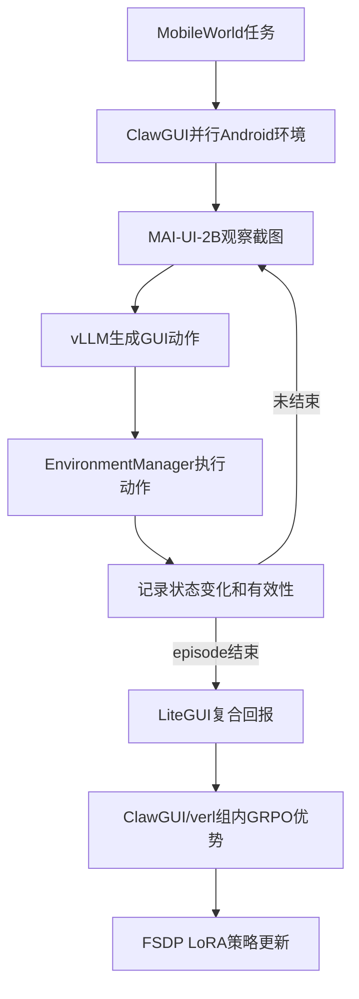

# LiteGUI-RL：基于 ClawGUI 的 2B 移动 GUI 在线 GRPO

本项目直接基于 **ZJU-REAL/ClawGUI** 官方仓库构建。训练主链没有重新实现：

基线源码版本：`d990d3e`（克隆时的ClawGUI主分支提交）。

- 多轮截图—动作 rollout：ClawGUI `agent_system/multi_turn_rollout`；
- Android 环境：ClawGUI-Server + MobileWorld；
- 强化学习框架：ClawGUI 内置的 verl；
- 调度、训练和推理：Ray Single Controller + FSDP + vLLM；
- 算法：verl 标准 GRPO，包括 old/ref log-prob、clipped objective、KL和动作token mask；
- 基础策略：`Tongyi-MAI/MAI-UI-2B`。

LiteGUI-RL只增加低成本奖励塑形、难度统计、LoRA配置和实验脚本，不替换官方Trainer。

## 相对ClawGUI增加了什么

| 文件 | 作用 |
|---|---|
| `clawgui-rl/agent_system/litegui/state_change.py` | 比较动作前后截图，生成确定性的状态变化分数 |
| `clawgui-rl/agent_system/litegui/reward.py` | 结果、状态变化、效率、无效动作、重复动作复合奖励 |
| `clawgui-rl/agent_system/environments/env_manager.py` | 在MobileWorld每一步记录截图变化和动作签名 |
| `clawgui-rl/agent_system/multi_turn_rollout/rollout_loop.py` | 完整episode结束后调用LiteGUI奖励塑形 |
| `clawgui-rl/verl/trainer/config/ppo_trainer.yaml` | 增加`env.litegui`配置块 |
| `clawgui-rl/examples/litegui/run_litegui_2b.sh` | MAI-UI-2B + LoRA + GRPO低成本训练入口 |
| `clawgui-rl/examples/litegui/task_difficulty.json` | 任务参考步数和初始难度层级 |

## 完整训练流程



## 奖励

对第\(i\)条轨迹：

\[
R_i = R_{success}
+ w_d(0.20R_{state}+0.20R_{efficiency})
-0.05N_{invalid}-0.03N_{repeat}
\]

- `R_success`来自MobileWorld系统级任务验证，始终是主要奖励；
- `R_state`是有效动作前后截图的低分辨率像素变化；
- `R_efficiency`只奖励成功轨迹，参考步数越短得分越高；
- `w_d`先使用`easy=0.85 / medium=1.0 / hard=1.15`冷启动先验，再根据每类任务的
  历史成功率EMA调整，最终限制在`[0.75, 1.50]`；
- 失败轨迹最多得到小幅过程奖励，不能超过成功轨迹。

难度权重只调节状态和效率项，不直接乘整个回报。原因是标准GRPO会对同一任务的多条轨迹
做均值/方差归一化；如果整个回报都乘相同任务权重，该权重会被归一化抵消。

## 训练数据来自哪里

本项目使用ClawGUI自带的MobileWorld任务表：

```text
clawgui-rl/examples/env_server/mobileworld_tasks.xlsx
```

`mw_onlinerl.py`读取任务名称、目标和涉及App，生成verl需要的Parquet。脚本中的
`geometry3k`只提供样本数量和视觉字段占位，数学题内容不会作为GUI训练问题；这是ClawGUI
官方数据预处理的原有逻辑。

`task_difficulty.json`里的难度层级与参考步数是可解释的人工初始值，不是实验结论；正式实验时
应根据训练集成功轨迹的步数统计重新校准，并保持测试集不参与校准。

训练轨迹不是提前标注的固定数据，而是MAI-UI-2B在Android环境中在线生成：

```text
任务 → 截图 → 动作 → 新截图 → …… → verifier结果 → GRPO更新
```

## 环境与显卡

默认低成本配置：

| 参数 | 默认值 |
|---|---:|
| 策略模型 | MAI-UI-2B |
| GPU | 2张 |
| LoRA rank | 16 |
| 任务batch | 2 |
| 每任务rollout | 4 |
| Android环境 | 8个 |
| 最大步数 | 15 |
| 历史截图 | 3张 |
| 外部PRM | 关闭 |

这里使用的是verl原生LoRA，不是自写QLoRA。完整在线训练仍需要NVIDIA GPU以及支持KVM的
Linux宿主机。环境数量至少为：

```text
train_batch_size × group_size = 2 × 4 = 8
```

## 运行

### 1. 安装ClawGUI-RL

```bash
cd clawgui-rl
conda create -n litegui-rl python=3.12 -y
conda activate litegui-rl

pip install vllm==0.11.0
pip install flash-attn==2.7.4.post1 --no-build-isolation --no-cache-dir
pip install -e '.[vllm]'
```

ClawGUI-Server和MobileWorld模拟器按照官方`clawgui-rl/README_zh.md`配置。把8个独立后端
地址写入：

```text
clawgui-rl/examples/env_server/mobileworld_server.txt
```

### 2. 准备占位数据和模型

```python
from datasets import load_dataset

dataset = load_dataset("hiyouga/geometry3k")
dataset.save_to_disk("/data/geometry3k")
```

下载MAI-UI-2B到本地，例如`/models/MAI-UI-2B`。

### 3. 启动训练

```bash
cd clawgui-rl

MODEL_PATH=/models/MAI-UI-2B \
GEOMETRY3K_DIR=/data/geometry3k \
DATA_ROOT=/data/mw_online_rl \
SERVER_FILE=examples/env_server/mobileworld_server.txt \
N_GPUS=2 \
bash examples/litegui/run_litegui_2b.sh
```

先做最小联调：

```bash
TRAIN_BATCH_SIZE=1 \
GROUP_SIZE=2 \
MAX_STEPS=5 \
TOTAL_CURRICULUM_EPOCHS=1 \
bash examples/litegui/run_litegui_2b.sh trainer.total_training_steps=1
```

## 验证代码

不启动GPU和模拟器也可以验证奖励逻辑：

```bash
cd clawgui-rl
pytest -q tests/litegui/test_reward.py
bash -n examples/litegui/run_litegui_2b.sh
```

测试覆盖：成功奖励优先级、无效/重复动作惩罚、难度EMA持久化。

## 对照实验

| 实验 | 配置变化 |
|---|---|
| MAI-UI-2B | 不训练 |
| ClawGUI-Binary-GRPO | `env.litegui.enable=False`，`step_reward_judge=False` |
| +StateChange | 只开启状态变化项 |
| +Efficiency | 加入成功轨迹效率项 |
| LiteGUI-RL | 再加入难度自适应塑形和动作惩罚 |
| ClawGUI-GiGPO+PRM | 官方高成本上界对照 |

需要报告成功率、平均成功步数、有效动作率、被过滤group比例、rollout耗时、训练显存和PRM
调用成本。没有真实跑完之前，简历不能填写虚构提升数字。

## 简历表述模板

> 基于ClawGUI/verl实现面向MAI-UI-2B的移动GUI在线GRPO训练，复用Ray、FSDP、vLLM和
> MobileWorld并行环境；设计任务难度自适应的状态变化—执行效率复合奖励，以确定性视觉状态
> 信号替代外部PRM，并通过LoRA、短历史和全同奖励组过滤降低在线训练成本；在MobileWorld
> 任务上相对Binary-GRPO将成功率从`__`提升至`__`，平均成功步数降低`__`。
